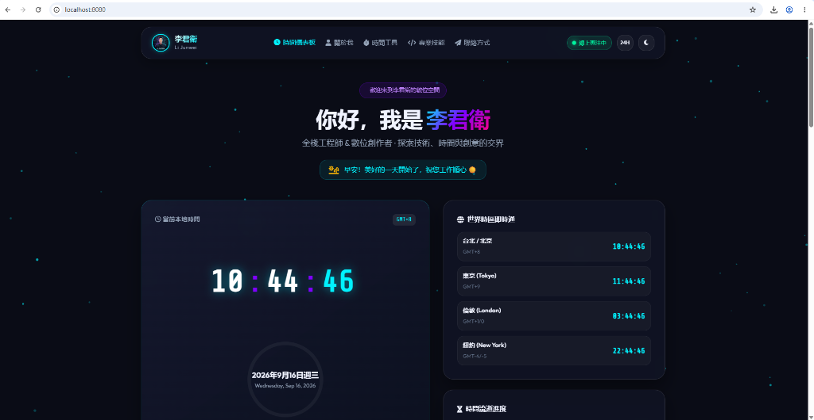

# 🌟 李君衛 (Li Junwei) - 個人主頁 & 即時時間儀表板


一個融合現代 **Glassmorphism 擬晶玻璃視覺**、**即時雙模數字時鐘**、**世界時區儀表板** 與 **高效率專注工具** 的高品質個人 Landing Page。

🔗 **Live Demo**: [https://jurass4207.github.io/0916/](https://jurass4207.github.io/0916/)



---

## 📸 畫面預覽與亮點 (Highlights)

- ⏰ **雙模極致時鐘**：支援 `12 小時制 / 24 小時制` 一鍵切換，配合 SVG 平滑環形秒針規律流轉。
- ☀️ **智能時段問候**：根據本地時間自動變化（早安 ☀️ / 午後好 ☕ / 晚上好 🌙 / 深夜好 ⭐️）。
- 🌍 **世界時區連動**：實時顯示台北/北京 (GMT+8)、東京 (GMT+9)、倫敦 (GMT+0/+1) 及紐約 (GMT-4/-5) 當前時間。
- ⏳ **時間流逝進度條**：直觀計算並視覺化展示 **今日**、**本月** 及 **今年 (2026)** 已流逝時間百分比。
- ⏱️ **高效率工具箱**：
  - **毫秒級碼錶 (Stopwatch)**：支援開始/暫停、分圈 (Lap) 紀錄與一鍵重置。
  - **番茄專注計時器 (Focus Timer)**：提供 25 分鐘專注、5 分鐘短休及 15 分鐘長休快選模式。
- 🌗 **主題與微互動**：支援深色 (Dark Mode) / 淺色 (Light Mode) 切換、動態 Canvas 浮動粒子背景及 Email 1-Click 複製提醒。

---

## 🛠️ 技術棧 (Tech Stack)

| 領域 | 技術 / 工具 | 描述 |
| :--- | :--- | :--- |
| **前端架構** | HTML5 / Vanilla CSS3 / JavaScript (ES6+) | 無第三方前端框架依賴，極速載入 |
| **視覺設計** | Glassmorphism, CSS Custom Variables | 深邃太空藍調、氣泡微透感與漸層發光特效 |
| **圖標與字型** | FontAwesome 6, Google Fonts | Outfit, Inter, Share Tech Mono (極客數位字體) |
| **背景特效** | HTML5 Canvas API | 響應式粒子動態與滑動軌跡 |

---

## 📁 專案目錄結構 (Project Structure)

```text
Personal Page/
├── index.html         # 主頁面語意化 HTML 結構
├── style.css          # Glassmorphism 設計系統與響應式樣式
├── script.js          # 時鐘引擎、世界時區、時間進度條與工具箱邏輯
├── README.md          # 專案說明文件
├── .gitignore         # Git 忽略檔案設定
└── assets/
    ├── avatar.jpg     # 李君衛 專屬形象頭像
    └── preview.png    # Live Demo 畫面截圖
```

---

## 🚀 本地快速啟動 (Quick Start)

### 方法 1：直接開啟
下載或 Clone 本專案後，雙擊開啟 [index.html](file:///c:/Users/user/Desktop/Personal%20Page/index.html) 即可在預設瀏覽器中執行。

### 方法 2：使用 Python 本地 HTTP 伺服器
```bash
# Clone 儲存庫
git clone https://github.com/Jurass4207/0916.git
cd 0916

# 啟動本地測試伺服器 (Port 8080)
python -m http.server 8080
```
開啟瀏覽器訪問 `http://localhost:8080` 即可預覽完整功能。

---

## 🌐 部署至 GitHub Pages (Deploy to GitHub Pages)

若想將本頁面發布為公開個人網站，只需：
1. 前往 GitHub 儲存庫頁面：`https://github.com/Jurass4207/0916`
2. 點擊 **Settings** -> **Pages**。
3. 在 **Build and deployment** > **Branch** 選擇 `main` 分支與 `/ (root)` 資料夾。
4. 點擊 **Save**，約 1 分鐘後即可獲得專屬網站網址！

---

## 📝 授權條款 (License)

本專案採用 [MIT License](LICENSE) 授權。歡迎自由使用與改編。

© 2026 李君衛 (Li Junwei). All Rights Reserved.
